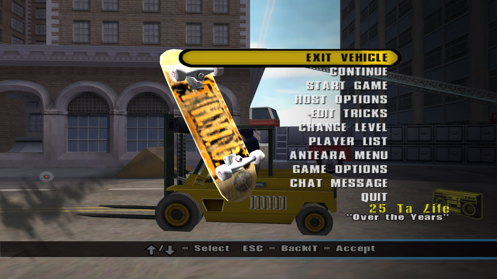

# THUG2 LEGACY MODS

This is a collection of old mods for Tony Hawk's Underground 2 (ca 2005 - 2010). <br>
The mods are meant to be used with the modloader from [PARTYMOD for THUG2](https://github.com/atljp/thug2-sdl), which combines old script mods with a modern game client.<br>
You can have multiple mods installed at the same time and specify which one to load in the configuration file.
<br><br>
So far, the following mods are included:
- Anteara Mod
- BeAsT´s wsz mod v2
- Bela MoD
- CHAD MOD 1.3
- CHC Mod
- Freeman Mod
- Ghetto Mod (Level Editor)
- Graf Kore 2.3
- kirillgta MoD
- MYANMOD

</img> </img> </img> </img> 

# INSTALLATION

First you need to download [PARTYMOD for THUG2](https://github.com/atljp/thug2-sdl) and extract its contents to your THUG2 Game directory.<br>
Find partymod.ini and set `UseMod=1` in the `AdditionalMods` section.<br>
Then you can specify a folder in the same section. You can also use this example:
```
[AdditionalMods]
UseMod=1
;Folder=data/pre/AntearaMod
;Folder=data/pre/BelaMoD
;Folder=data/pre/BeAsTwszMod
;Folder=data/pre/CHADMOD1.3
;Folder=data/pre/CHCMod
;Folder=data/pre/FreemanMod
;Folder=data/pre/GhettoMod
;Folder=data/pre/GrafKore2.3
;Folder=data/pre/kirillgtaMoD
;Folder=data/pre/myanmod
```
Remove the ";" from the mod you want to load.
<br><br>
Finally, download this repo (green button at the top, download as zip) and copy the `pre` folder to `C:\<thug2-install-path>\Game\Data\`.

# NOTES

To guarantee compatibility, set `NoAdditionalScriptMods=1` in partymod.ini.<br>
If a mod is loaded successfully and you are using window mode, the window title will show the mod name.<br>
Make sure to specify folders and files as shown in the examples; relative paths like `data/pre/mymod` in partymod.ini and filenames with the `.prx` extension in mod.ini (inside each mod folder).
<br><br>
Several old mods have installers that don't work anymore as they download files from remote URLs that no longer exist. If you have installed mod files you want to be included you can send them on Discord: @trxbail.